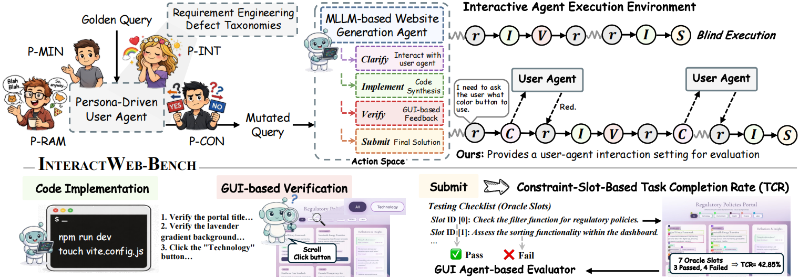

<p align="center">
  
</p>

<h3 align="center"><strong>InteractWeb-Bench</strong>: Can Multimodal Agent Escape Blind Execution <br>  in Interactive Website Generation?</h3>

<p align="center">
  <a href="wangqiyao.me">Qiyao Wang</a><sup>1,2,*</sup>, Haoran Hu<sup>3,*</sup>, Longze Chen<sup>1,2</sup>, Hongbo Wang<sup>3</sup>, Hamid Alinejad-Rokny<sup>4</sup>, Yuan Lin<sup>3,†</sup>, Min Yang<sup>1,5,†</sup>
</p>

<p align="center">
  <sup>1</sup>SIAT-NLP, <sup>2</sup>UCAS, <sup>3</sup>DUT-IR, <sup>4</sup>UNSW Sydney and <sup>5</sup>SUAT
</p>

<p align="center">
  <sup>*</sup> Equal Contribution &nbsp;&nbsp; <sup>†</sup> Corresponding Authors
</p>

<p align="center">
  <a href="https://interactweb-bench.wangqiyao.me/">🌐 Homepage</a> |
  <a href="">🤗 Dataset</a> |
  <a href="https://arxiv.org/pdf/">📖 Paper</a> |
  <a href="https://huggingface.co/papers/">🤗 HuggingFace Paper</a> |
  <a href="https://github.com/AIforIP/InteractWeb-Bench">GitHub</a>
</p>


This repo contains the evaluation code for the paper "[InteractWeb-Bench: Can Multimodal Agent Escape Blind Execution in Interactive Website Generation?](https://arxiv.org/pdf/)"

## 🔔 News

- 😄 [2026-04-30] Releasing [Code and Data](https://github.com/AIforIP/InteractWeb-Bench).
- 😄 [2026-04-24] Releasing [Website](https://interactweb-bench.wangqiyao.me/).
- 🔥 [2026-02-16] Research Begining.

## 📅 Timeline

- [x] Code
- [x] Dataset
- [ ] Software Demostration

## 📝 Introduction
InteractWeb-Bench is a multimodal interactive benchmark for evaluating website generation agents under real-world, non-expert user conditions. 

It simulates ambiguous, noisy, and conflicting user instructions through persona-driven user agents, and introduces a dynamic action space (Clarify, Implement, Verify, Submit) to assess agents’ ability to escape “blind execution” and align with user intent.

This project provides a realistic environment for studying interactive code generation, intent clarification, and GUI-based verification.




## 🚀 Quick start 

Follow the steps below to quickly set up and run **InteractWeb-Bench**.

### 1. Environment Setup

```bash
conda create -n InteractWeb-Bench python=3.10 -y
conda activate InteractWeb-Bench
pip install -r requirements.txt
```
```bash
playwright install chromium
```
Install Node.js:
```bash
cd scripts
bash install_node.sh
```
### 2. Configure Environment Variables
Create your .env file:
```bash
cp .env.example .env
```
Edit .env and fill in your API keys and model endpoints.
### 3. Configure Experiment Settings
Edit config.yaml in the root directory:
```YALM
data_path: "path_to_your_dataset.jsonl"
output_dir: "/path_to_your_workspace/experiment_results"
models:
  builder_model: "your_builder_model"
  visual_copilot_model: "your_visual_model"
  webvoyager_model: "your_judge_model"
  user_model: "your_user_model"
```
### 4. (Optional) Launch Local Models
If using local models, start your vLLM services:
```bash
bash src/scripts/deploy_your_local_model.sh
```
You can configure multiple models and ports via LOCAL_MODELS_MAP.
### 5. Run the Benchmark
```bash
python src/experiment/run_simulation.py --config /your_config_path/
```
### 6. (Optional) Docker Deployment
```bash
docker load -i interactweb-bench_v1.0.tar
bash docker_run.sh
```
Then run:
```bash
python src/experiment/run_simulation.py --config /your_config_path/
```
## Citation

When citing this work, please use the following BibTeX entry:

```bibtex

```

## Contact
Feel free to contact the author with `wangqiyao25@mails.ucas.ac.cn`.


